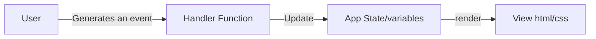

# DOM Document Object Model
- Tree map of connected html elements nodes
- A web page is made up of html elements
  - Those elements are nested
  - Those elements can be represented in a tree graph

- JS can maniulate the DOM. The original/primary purpose of JS.
  - Adding HTML elements
  - Modifying attributes on elements
  - removing elements
  - etc....

## JS is an Event Driven Language
- Whenever ANYTHING on happens a web page. An event is created.
  - Examples
    - Click
    - Mouseover
    - pressing a button on keyboard
    - any input changes 
- With JS we can handle these events are respond dynamically

## Mental Model for web pages

- ***State Managment is the CORE part of Web Development***
- JavaScript variables/values and the visual HTML have no instrinsic relationship
  - Treat them as two seperate things
  - JS is behind the scenes
  - HTML is what the user actually sees and interacts with

