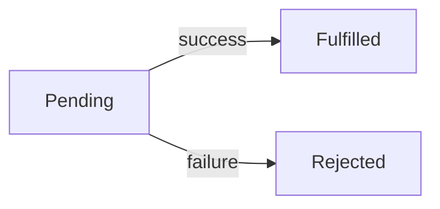

# Week 1 Review
- ***Take The mini quiz at the bottom of each topic in the curriculum***


## Git
- The problem
  - **Keeping track of software edits and code is very difficult**
  - Code changes all the time
  - Newly added code can break old features
  - Multiple are often adding files or editing files
- ***All software code is literally fancy text files***
  - There is nothing special about your .js file
  - It is functionally identical to a .txt file

# Git as a solution
- git is ***Version Control Software/System*** VCS
  - It is a system for making changes to files and folder and tracking those changes
  
### Keywords
- **Repository**
  - Is a folder containing files and folders
  - **Remote Repository**
    - A centralized location for files and folders
    - The remote repository is the source of truth that everyone will work off of and contribute to
  - **Local Respository**
    - A **COPY** of the remote reposity on your local machine/computer
    - You directly make changes to the local repository
      - For instance by directly editing files in VS code


### Important commands
- Copy the remote repo to your local machine
```bash
git clone https://repolocation
```


- If you make a change or add a file to your local repo you use git add .
- Puts all changes into a staging area
```bash
git add .
``` 
- if you are confident in your changes you do git commit
```bash
git commit -m "some message"
```
- if you want put your local repo version and add put it on the remote repo you use git push
```bash
git push
```
### Important Notes
- .git folder is hidden
  - Contains a record of edits and transactions
  - You never need to access this
  - Whenever you run git commands *OTHER* than git clone you want to be in the directory that has this .git folder

### Statuses
- U Untracked
  - The file is in the local repository but **NOT** in the remote repository
- A Added
  - The file is in the **staging area** in the local repository but still not in the remote repository
- M Modified
  - The file exists in the remote repository but the local version of that file has been edited

## JavaScript

### History and Philosophy
- Most popular programming language in the world
- Was developed in 9 days
  - Has lots of quirks from a rushed design process
- Designed to be as flexible and unoppinoinated as possible
- No real relation to Java
  - Was a marketing ploy
- Was designed as a programming language to make web pages dynamic.

### Core Features
- loosely typed language
  - JS has really aggresive type coercion
- Dyanmically typed language
  - You do not have to declare the type of variables
- Very functional programming language
  - Does have support for Object oriented programming
  - Seeing classes in JS is *very rare*
- High Level Programming lanugage
  - There is no low level memory managament like pointers.
- Event Driven
  - Designed to process events as they arrive
- Single threaded
  - Unable to run tasks in parallel
- Asynchronous
  - Can run tasks in the background

### Syntax features

#### Scopes
1. global Almost never use global variables.
   1. no keyword (default scope of a variable)
2. function Scope 
   1. var
   2. NEVER use the var keyword Friends don't let friends use var
3. block scope
    1. let or const
```JavaScript
function greet(fname, lname){

    fullName = fname +" "+ lname; // fullName is a global variable. It exists for entirety of the program and anyting access it
    console.log(fullName);
}

greet("Adam", "Ranieri");
console.log(fullName); // access to the global fullName outside the function


function hola(fname, lname){

    if(true){
        var fullName2 = fname + " " + lname; // var makes the variable funciton scoped
    }
    
    console.log(fullName2);
}

hola("Rory", "Eiffe");
//console.log(fullName2);// not defined

function bonjour(fname, lname){

    let full;
    if(true){
        full = fname + " " + lname; // let is block scoped. Cannot escape the curly brackets it was defined in
    }
    console.log(full); // not defined
    const value = "Finished"; // const has the same scoping rules as let but you cannot reassign t
}
```

#### Hoisting
- JS does not read and execute code line by line
- JS has a 2 pass system 
  - The file is scanned
  - The code is executed
- Some variables are hoisted
  - They can be used before they are declared
    - functions made using the function keyword
    - variables made with var

#### Data Types
- Everything in JS is an object
- Primitive types
  1. number
  2. string
  3. boolean
  4. null
     1. Explicit assignment
  5. undefined
     1. Default value in JS
  6. symbol Almost nobody will use this
  7. bigint A new addition for massive numbers  

#### Type Coercion and Truthy Falsy
- All variables can be coerced to true or false
  - Everything is true except for the falsy values
```JavaScript
// The falsy values (they are all false because they represent nothing in a way)
console.log(Boolean(0));
console.log(Boolean(""));
console.log(Boolean(null));
console.log(Boolean(undefined));
console.log(Boolean(false));
console.log(Boolean(NaN)); // not a number
```

```JavaScript
//Loose Equality Operator
console.log(10 == "10")//true

//Strict Equality Operator
console.log(10 === "10");// false
```

#### Arrays
- Can hold any value
- Dynamically resize
- have a lot of helpful higher order functions
  - forEach
  - map
  - filter
```JavaScript
const people = ["Adam", "Bill", "Charles", "Dean"];

for(const p of people){
    console.log(p);
}

const temps = [212, 40, 0, 32, -75];
const celciusTemps = temps.map(farenheitToCelcius);

```

#### Object Literals
- 99% of JS objects are created without a class using object literal syntax
- An object is a collection of Key Value pairs
- Objects are always mutable
  - Properties can be added, changed or deleted at anytime
```JavaScript
const adam = {fname:"Adam", lname:"Ranieri", age:19, isTrainer: true};

adam.fname = "Frank"; // you can reassign the properites on an object at anytime

adam.mi = "C";// you can add a property at anytime


const tebow = {
    fname: "Tim",
    lname: "Tebow",
    universityInfo:{
        name:"University of Florida",
        location: "Gainesville"
    }
}
console.log(tebow)
console.log(tebow.universityInfo.name)
```
#### Functional Programming
- JS is functional programming lanugage
- ***FUNCTIONS ARE OBJECTS***
  - They can be dynamically crafted
  - They can be returned from functions
  - They can be passed into functions

##### Function Keyword vs Arrow Function
- Two main differences
  - `this` keyword works differently within the functions
  -  `function` keyword functions are hoisted
-  Arrow functions are **mostly** just a cleaner syntax

```JavaScript
function hello(name){
    console.log("Hello "+name);
}

const hola = function(name){
    console.log("Hola " + name);
}

//Arrow syntax
const bonjour = (name) =>{
    console.log(name)
}

const add = (num1, num2) =>{
    return num1 + num2;
}

// if your function body is a one liner. You do not need a return and curly brackets
const mulitply = (num1, num2) => num1 * num2;

//console.log(mulitply(9,10));//90

// if the function only takes in one input. the parentheses are optional
const gutentag = name =>{
    console.log("Gutentag " + name);
}
```

#### Callback Function and Higher Order Functions
- ***Callback Function***
  - A function passed as a **parameter** to another function
- ***Higher Order Function***
  - A function that accepts a callback function
```JavaScript
function isPositive(num = 0){
    return num >= 0;
}

// callback function -> isPositive
// higher order function -> filter
const positiveTemperaturs = temps.filter(isPositive);
```

##### Closures
- Functions are *always* able to access variables that are in scope when the function is created.
- If you return a function that uses a variable that was defined previously it is considered enclosed

```JavaScript
function Car(){

    let mileage = 0;

    function driveCar(miles){ // functions are created dynamically. With the variables they point to dependent on when it was executed
        mileage += miles; // mileage is the enclosed variable
        console.log("The mileage is now "+mileage)
    }

    return driveCar;
}

const driverCar1 = Car();
driverCar1(200)// prints 200
driveCar1(300)// prints 500
```


## Web Browser
- It is a desktop application
- ***ANYTHING*** on a web page, the html, the css, the JS is visible and editable by the User.
- Web Browsers are fault tolerant and try to make your web pages work even if not 100% compliant
- **Hosting** is making a piece of software publicly accesible

## The main features of a web browser
- HTML/CSS renderer
  - Ability to read .html and .css files and visually represent them
- JavaScript runtime environment
  - Allows the browser to execute JS
  - Allows dynamic webpages that responed to user actions
- HTTP Client
  - Ability to make http requests
  - Allows a browser to interact with computers on the internet

### HTML Hyper Text Markup Language
- Is ***NOT*** a programming language
  - HTML lacks the ability to perform logic
- Markup
- HTML defines the ***Content and structure*** of a web page
- HTML is made up of building blocks called ***tags*** or ***elements***
- When you navigate to a website your web browser is downloading an html file to show you


### Anatomy of an element
- Elements have an opening and closing tag
  - Some elements are self closing
- Elements have attributes
  - tags that add extra information or properties to the element
- Elements are nested but should not overlap
```html
    <!-- traditional tag -->
    <element attr="value">Content</element>

    <!-- selfclosing tag -->
    <selfclose/>

    <!-- nested -->
    <div> 
        <h6>Hello</h6>
        <h6>Hola</h6>
    </div>


    <!-- overlapping tag -->
    <div> 
        <h6>Hello</h6>
        <h6>Hola
    </div>
    </h6>

```
### Common Elements

```html
<!-- Required -->
<!Doctype html>
<html>
  <head></head>
  <body></body>
</html>


<!-- headings -->
<h1>Largest</h1>
<h6>Smallest</h6> 

<!-- text -->
<p></p>
<b></b>
<sub></sub>
<del></del>

<!-- lists -->
<ul></ul>
<ol></ol>
<dl></dl>

<!-- table -->
<table>
  <thead> 
    <tr><th></th></tr>
  </thead>
  <tbody> 
    <tr><td></td></tr>
  </tbody>
</table>

<!-- image -->

```

### CSS Cascading Style Sheets
- Adds aesthetics and styling to a web pag
  - ***Not a programming language***
- Domain Specific Language DSL
  - A lanugage designed for one thing 
    - CSS => Styling web pages
    - SQL => Database managament
- ***Cascade Algorithim***
  - multiple css selectors will apply styling to the same element
  - The algorithim determines what is the ultimate style applied
  - *the most specific css selector wins*

### Anatomy of CSS
- Key value pair pairs called attributes
- Selectors are how you specify what element(s) the CSS styling applies to
  - id
  - tag type
  - css class

```css

selector{attribute:value}
p{background-color:red}


```
### How to add CSS to a web page
1. Apply CSS inline to an element using the `style attribute`
2. You can use the `style tag` in the head to apply styles
3. You can reference and external style sheet using the `link tag`


## HTTP Hyper Text Transfer Protocol
- It is the main way of sending information on the web
  - The definition of a a web application is that it uses HTTP communicate
- HTTP is a request Responese based system
  - ***Client***
    - Person or browser or piece of software that makes an ***HTTP Request***
  - ***Web Server***
    - Computer or application that responds to an HTTP Request with an ***HTTP Response***
    - information and files are stored on web servers

### Anatomy of an http request and Response

##### Request
- Version of HTTP it is using
  - Pertinent if you get trapped in a time loop to the early 2000's
- URL
  - Uniform Resource Locator
  - Wherever the HTTP request is going
- Verb
  - The of HTTP request
  - The verb describes what the request is *supposed* to do
    - get
      - Get or read information back from a server
    - post
      - Send information to a server to create somthing
    - put
      - Send information to update something on a web server
    - delete
      - Send information to delete something on a web server
- Body (optional)
  - The information you are sending with the request
- Headers
  - Key value pairs that are *meta information* about the request
    - Authentication is a big example

##### Response
- Status Code
  - How a request was handled by a web server
    - 100's
      - Information
    - 200's
      - Successfully completed the request
    - 300's
      - Redirected
    - 400's
      - Client makes a mistake in sending the request
      - 403
        - forbidden
        - You do not have access
      - 404
        - Not found
      - 405
        - unauthorized
        - You are not logged in
      - 415 
        - No teapot
      - 451
        - Not avaiable due to government censorship
        - named after the book Farenheit 451
    - 500's
      - Server encounters an error when processing the request
- Body
  - Information sent back in the request
    - String
      - JSON
    - File
      - Html
      - CSS
      - JS
- Headers
  - Key value pairs that are meta information for the response


# HTTP Hyper Text Transfer Protocol
- It is the main way of sending information on the web
  - The definition of a a web application is that it uses HTTP communicate
- HTTP is a request Responese based system
  - ***Client***
    - Person or browser or piece of software that makes an ***HTTP Request***
  - ***Web Server***
    - Computer or application that responds to an HTTP Request with an ***HTTP Response***
    - information and files are stored on web servers

### Anatomy of an http request and Response

##### Request
- Version of HTTP it is using
  - Pertinent if you get trapped in a time loop to the early 2000's
- URL
  - Uniform Resource Locator
  - Wherever the HTTP request is going
- Verb
  - The of HTTP request
  - The verb describes what the request is *supposed* to do
    - get
      - Get or read information back from a server
    - post
      - Send information to a server to create somthing
    - put
      - Send information to update something on a web server
    - delete
      - Send information to delete something on a web server
- Body (optional)
  - The information you are sending with the request
- Headers
  - Key value pairs that are *meta information* about the request
    - Authentication is a big example

##### Response
- Status Code
  - How a request was handled by a web server
    - 100's
      - Information
    - 200's
      - Successfully completed the request
    - 300's
      - Redirected
    - 400's
      - Client makes a mistake in sending the request
      - 403
        - forbidden
        - You do not have access
      - 404
        - Not found
      - 405
        - unauthorized
        - You are not logged in
      - 415 
        - No teapot
      - 451
        - Not avaiable due to government censorship
        - named after the book Farenheit 451
    - 500's
      - Server encounters an error when processing the request
- Body
  - Information sent back in the request
    - String
      - JSON
    - File
      - Html
      - CSS
      - JS
- Headers
  - Key value pairs that are meta information for the response
  

## JSON JavaScript Object Notation
- String version of a JavaScript Object
- Why do JSONs exist?
  - Web Servers can be written in any language
  - Web Servers need to be able handle HTTP requests
    - Web Browsers are the biggest HTTP client in the world
  - If you are sending data to a Python Web Server python would have no idea what to do
    - If a python web server sent back a Python object to the web browser as the HTTP response
      - The JS in the browser would have no way to use it
- There was one data type that just about every programming language supports.
  - ***Strings***
  - Strings are supported by almost programming language
  - Programming languages can parse JSONs into their own specific objects for that language
- JSONs are for transporting and storing data
  - ***Reading and writing JSONs will be a huge skill that you learn***
  - functions are excluded when an object is turned into a JSON
    - A python application would have no way of running a JS function
    - JSONs are for passing **data** not **code**

- Many web servers DO NOT return HTML or CSS.
- They return JSONs
  - Just data
- Web Servers that send and recieve JSONs have an ***API***
- Application Program Interface
  - The API of a web server is the part of the `application` that you `interact` with `programatically`
    - Programatically means making HTTP request with a programing language


## Asynchronous Operations async await
- Real life Example
  - If you are hosting a party their are several things you have to do
    - Clean up the living room
    - Put drinks in the fridge
    - Order a pizza to be delivered
      - Pizza arrives asynchronously
    - Put out plates for everyone
    - Put the game on the TV.
- HTTP requests are like ordering a pizza
  - The reponse could take a long time to get back to the browser
  - We can use a special `async` `await` to wait on snippets of code that execute asynchrously
    - A ***Promise*** is a wrapper around a value that can be awaited.
    - A promise represents a value that will eventually exist
      - A promise is `fulfilled` if the value in the promise is completed without error
      - If the value in the promise cannot be completed then an Error is put in the promise and is considered `rejected`
  - Promise Life cycle
