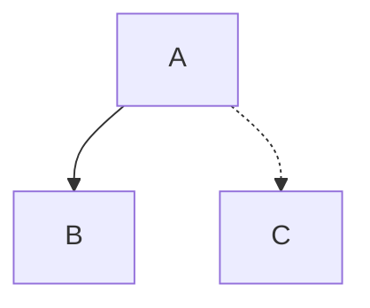

```mermaid
graph TB;
    A-->B;
    A -.->C;
```

- Will need an extension: "Markdown Preview Mermaid Support" to show off in VS Code
- Resources:
    - https://mermaid.live/edit
    - https://jojozhuang.github.io/tutorial/mermaid-cheat-sheet/