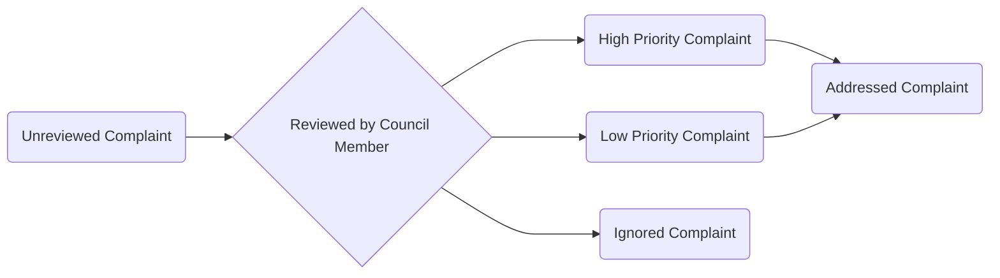

# Project 2

## Overview
You will be building a Town Complaint Submission Application for a fictional town of your choice (have fun with it!) Gotham, Smallville, Hawkins etc.... Consitutents submit complaints for issues in their town. Council members will review issues and create meetings where the complaints will be discussed. Your application will be fully hosted on AWS.

### Presentation
You will demo the application in front of the batch. You will be sending a link to your hosted application.


### Timeline
- 3/17
  - Unregistered Constituent user stories complete
- 3/22
  - Primary user stories complete
- 3/23
  - Application is hosted on AWS
- 3/24
  - Presentation


## User Stories

### Important Terminology
- Unregistered Constituent
  - Any user of the application that is not logged in
- Council Member
  - A council memeber who has logged in
- Registered Constituent
  - A constituent who has logged in
- Complaint
  - A grievance sent by a community member


#### Complaint statuses



### Primary User Stories
|As a| I Want To | So That|
|----|-----------|--------|
|Unregistered Constituent| Report Complaints | The Town Council can address them|
|Unregistered Constituent| View Meetings | I can attend meetings relavent to me |
|Council Member| Review Complaints | I can sort their priority or ignore them|
|Council Member | Create Meetings |  The town can dicuss complaints|
|Council Member | Attach complaints to meetings | contituents can attend meetings pertinent to them|
###### Note
*council members can be hardcoded into your DB*


### Stretch User Stories
#### Do AFTER you have completed the primary user stories
|As a| I Want To | So That|
|----|-----------|--------|
|Unregistred Constituent| Request an account | I can access feautres available to Registered Constituent|
|Council Member | Approve Constituent Registration Request | I can verify constituent information |
|Registered Constituent| Request to speak at a specific meeting | I can voice my complaints directly|


## Deployment
- Backend must be containerized and deployed on AWS
- Database must be hosted on RDS 
- Front-end statically hosted on S3
- Front-end code should be in a GitHub Repo
- Backend-end code should be in a seperate GitHub repo
- CI tests for backend 
  - GitHub actions has been set up and can be used
  - Project analyzed on SonarCloud

## Technical Requirements
- All DAO methods tested
- Service methods with bussiness logic should be tested using Mockito
- Logging 
- Backend built using Spring Boot
- Front-end using React
  - No requirement to use Saga, React Query or Redux though you may choose to do so

- Backend must support the following endpoints
  - You may add others if necesaary or apporpriate
    - Many of the stretch user stories will require more endpoints
  - The status codes are possible status codes that might be returned from that endpoint
  
| route                            | verb   | action                         | Status Codes                     |
|----------------------------------|--------|--------------------------------|----------------------------------|
| /complaints                      | POST   | Creates a new complaint        | 201                              |
| /complaints/{id}                 | PUT    | Replaces a complaint           | 200, 404                         |
| /complaints/{id}                 | GET    | Get a Complaint by ID          | 200, 404                         |
| /complaints                      | GET    | Gets all complaints            | 200                              |
| /complaints?status={status}      | GET    | Gets complaints by status      | 200                              |
| /login                           | PATCH  | Returns that users information | 200, 422                         |
| /meetings                        | GET    | Returns all meetings           | 200                              |
| /meetings/{id}                   | GET    | Gets a meeting by ID           | 200, 404                         |
| /meetings                        | POST   | Creates a new meeting          | 201                              |
| /meetings/{id}                   | PUT    | Replaces a meeting           | 200, 404                         |
| /meetings/{id}                   | DELETE | Deletes a meeting              | 404                              |

### ERD
You do not have to use this exact SQL ERD but this is the simplest ERD that will fulfill all primary user stories
```sql
-- if you ever find yourself writing 2 tables that have very similar columns but refer to different types of people
-- you most likely want to have 1 table with a column denoting the role
create table app_user(
	user_id serial primary key,
	username varchar(40),
	password varchar(40),
	role varchar(30)
);
create table meeting(
	meeting_id serial primary key,
	address varchar(200),
	time int, -- use unix epoch time 
	summary varchar(200)
);
create table complaint(
	complaint_id serial primary key,
	description varchar(200),
	status varchar(40),
	meeting_id int references meeting(meeting_id) default -1
);

-- examples
insert into meeting values(-1,'NO MEETING ASSIGNED', 0, 'NOT A REAL MEETING');
insert into app_user values (default, 'adamGator','pass123','COUNCIL');
insert into app_user values (default, 'patrick99', 'pat1','CONSTITUENT' );
insert into complaint values (default,'super villain blocking trash pick up', 'UNREVIEWED', null); -- works and accurately models the data
-- I prefer to not use null and set a default of -1 beacuse when I see e a null value in my code I think it is an error
insert into complaint values (default,'Shadow monsters are rummaging in my backyard', 'UNREVIEWED');
```