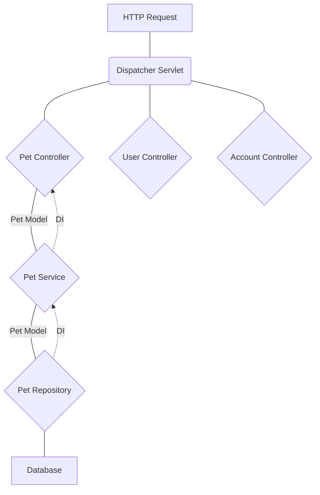

## Beans (Non-Exhautive):
- PetController
  - Dependencies: PetServiceImpl
- PetServiceImpl
  - Dependencies: PetRepository
- PetRepository
  - Dependencies: Inner Beans and JpaMappingContext

## Annotations Used:

### Spring
- @Autowired
  - Stereotypes:
    - @Component
    - @Service
    - @Controller
    - @Repository

### Spring Web
- @RequestMapping
- @ReponseBody
- @ReponseStatus
- @GetMapping
- @PostMapping
- @PatchMapping
- @DeleteMapping
- @PutMapping
- Get Data from Requests:
  - @RequestBody
  - @PathVariable
  - @RequestParam
- @RestController

### Spring Data
- @Query
- @Transactional

### Persistence:
- @Entity
- @Table
- @Column
- @Id
- @GeneratedValue

### Spring Boot
- @SpringBootApplication
  - @ComponentScan
  - @Configuration
  - @EnableAutoConfiguration

### MVC
- Controller - PetController
- Model - Pet entity
- View - Handled in React